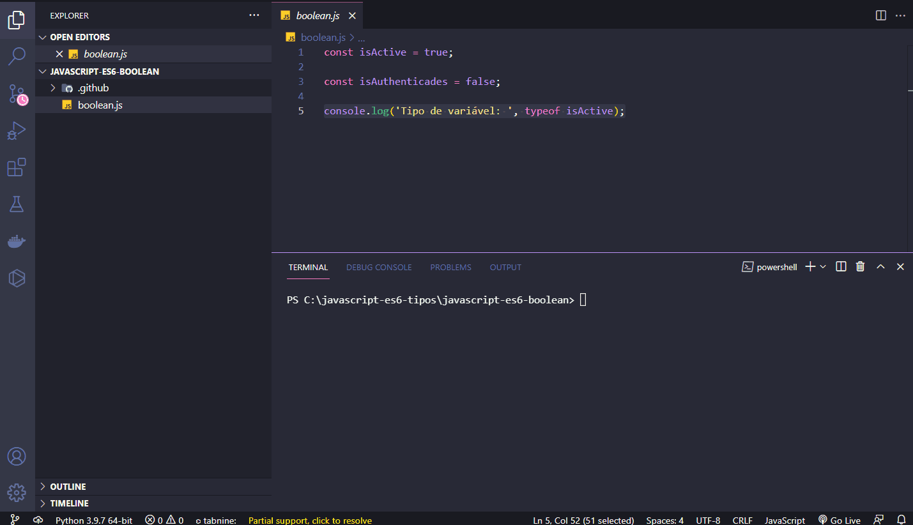
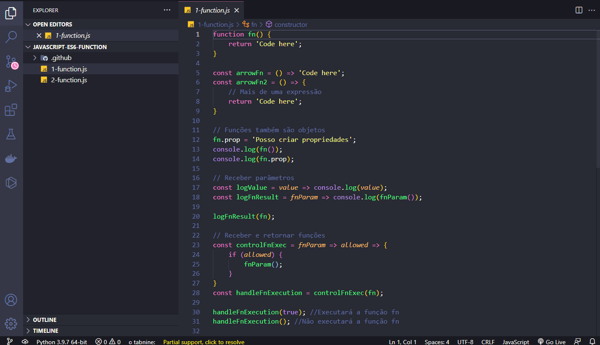
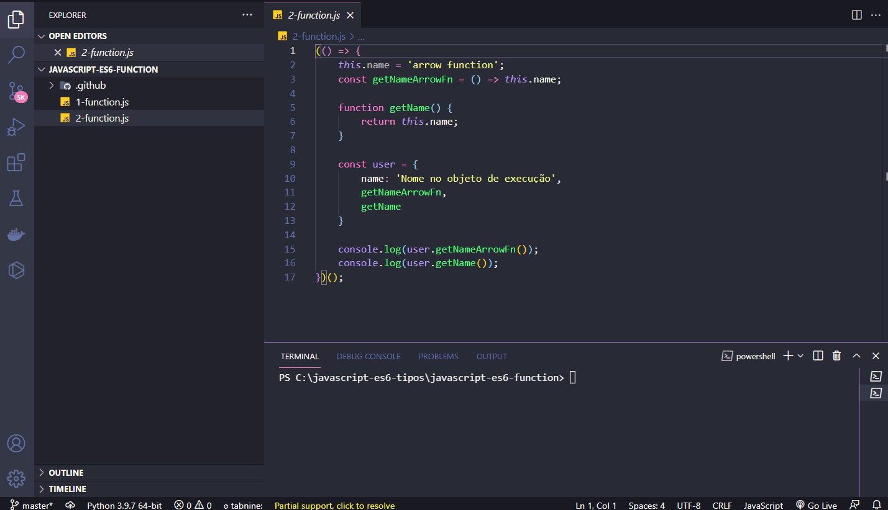
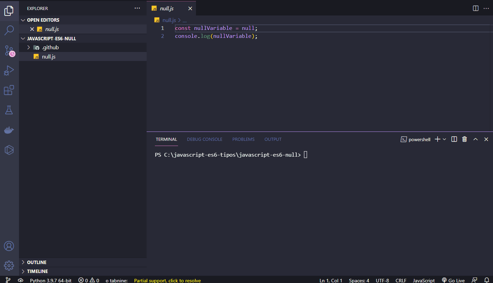
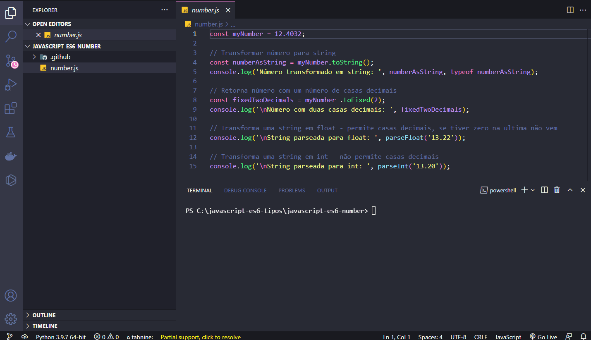
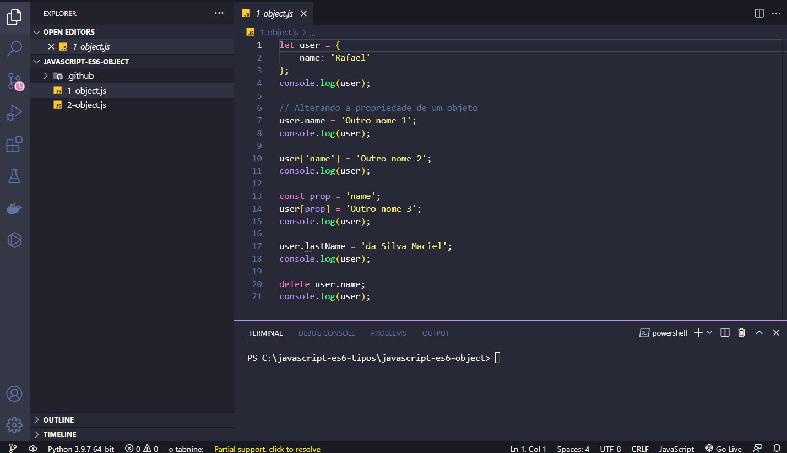
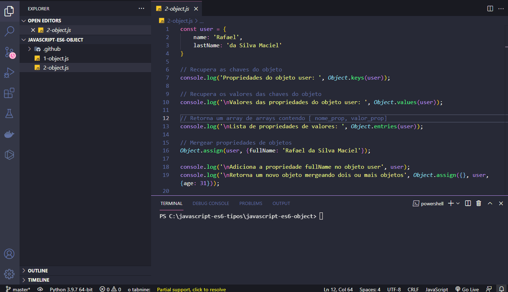
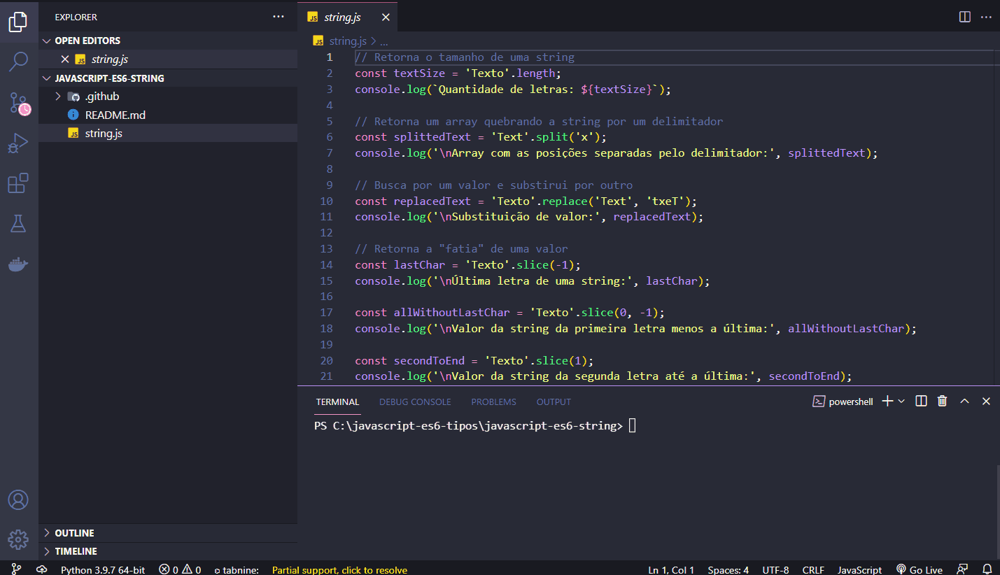
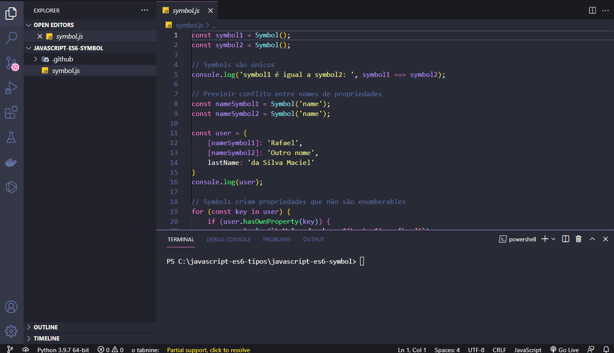
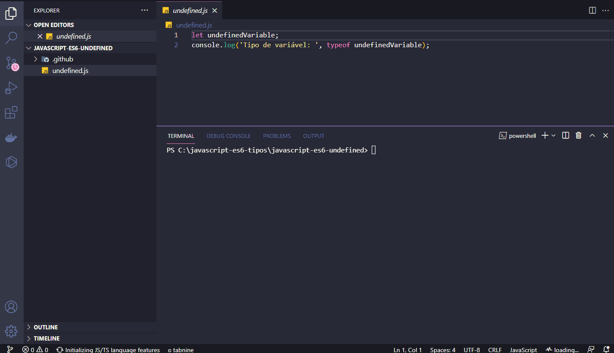

<h1 align="center">
  
   
  JavaScript ES6 - Types
</h1>

<h3 align="justify">
Didactic demonstration of the main JavaScripty ES6 types. Credits for the Digital Innovation One Essential ES6 JavaScript module.
</h3>

 

## 📷 Demonstration

<h4 align="left"> Boolean </h4>
  
   
<h4 align="left" > Function </h4>  
  
   
<h4 align="left" > Function2 </h4>  
  
   
<h4 align="left"> Null </h4>
  
   
<h4 align="left"> Number </h4>
  
   
<h4 align="left"> Object </h4>
  
   
<h4 align="left"> Object2 </h4>
  
   
<h4 align="left"> String </h4>
  
   
<h4 align="left"> Symbol </h4>
  
   
<h4 align="left"> Undefined </h4>
  
   

 

## 🚀 Technologies

This project was developed with the following technologies:

- JavaScript ES6
- NodeJS

 

## ⚙ Operators
- boolean
- function
- null
- number
- object
- string
- symbol
- undefined

 

---

Made with 💜 by Rafael Maciel
